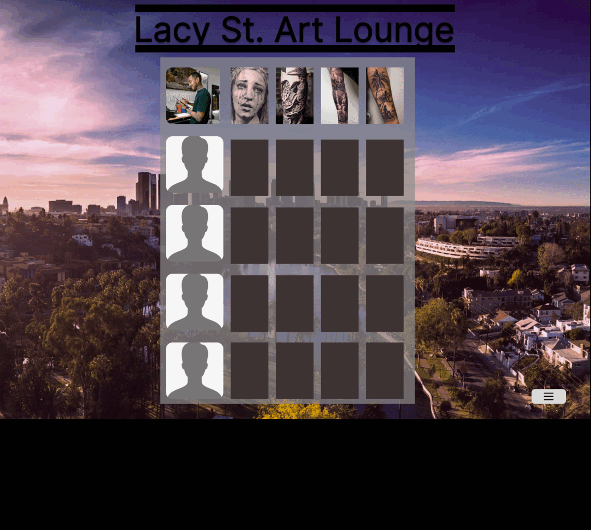

  

## Table of Contents

---

- [Table of Contents](#table-of-contents)
- [Team Members](#team-members)
- [Background](#background)
- [Solution](#solution)
- [Prototype](#prototype)
- [Timeline](#timeline)
- [Website Demo](#website-demo)
- [Testing](#testing)
- [Run and Deploy](#run-and-deploy)

## Team Members

---

  

- [Dane Coleman](https://github.com/daneski9)
- [Aaron Shackelford](https://github.com/chessset5)
- [Abdul Malek Abdul Khaliq](https://github.com/malekus40)
- [Carlena Schwab](https://github.com/carlenacodes)
- [Eric Jimenez Chavez](https://github.com/TwerpZ)
- [Igor Oleshko](https://github.com/ioleshko1)
- [Marjeela Habib](https://github.com/marjeela)
- [Timothy Quiba](https://github.com/tquiba)

## Background

---

Lacy St. Art Lounge is a popular LA tattoo parlor with talented artists and various styles. The space is stylish and artistic, with strict hygiene standards. It’s a great place to get a quality and original tattoo in the Los Angeles Area.

## Solution

---

The solution of this project is to developed web application for the Lacy St. Art Lounge tattoo parlor. This website showcases the portfolios of the artists working at the tattoo parlor, allowing potential customers to browse through their previous works and get a sense of their artistic styles. This website also provides detailed information about the services offered, including tattoo styles, and pricing. One of the important features of the website will be the ability to submit an inquiry that will enable clients to easily submit inquiries with the required information. Additionally, this website facilitates client-artist communications, allowing clients to directly communicate with their chosen artists to discuss their tattoo ideas and ask questions. By providing a user-friendly and informative website, the Lacy St Art Lounge aims to enhance customer convenience and satisfaction, increase business visibility in the digital realm, and improve the overall efficiency in managing inquiries and appointments. This website will serve as a powerful tool to attract new clients, showcase the artistic talent of the tattoo artists, and elevate the professional image of the tattoo parlor.

## Prototype

---

  

 
During our prototype phase, we developed a figma demo which showcased our ideas for the website. In the demo (viewable above) we created a few of the base pages that would be used for the final product. 

The following pages were created:
   Contact page for getting in contact with the artist
   Main portal to select the artist
   Admin login to modify the websites’ contents
   Service page to show off the the available tattoo areas
   About page for the artist
   Portfolio page to show of the artist’s artwork
   And the inquire page that was deprecated to the contact page later in development
   

## Timeline

---

THE TIMELINE _____

## Website Demo

---

  

This section will provide GIF that showcases a walkthrough of the deployed Lacy St. Art Lounge web application.

## Testing

---

Testing will be added next semester

## Deployment

---

Deployement instructions will be added next semester

## Developer Instructions

---

Developer instructions will be added next semester

