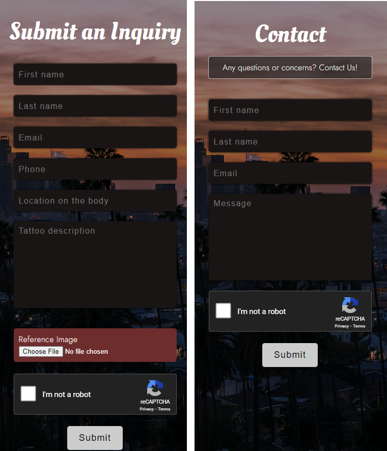

  

   

## Table of Contents
---

- [Table of Contents](#table-of-contents)
- [Team Members](#team-members)
- [Background](#background)
- [Solution](#solution)
- [Prototype](#prototype)
- [Timeline](#timeline)
- [Website Demo](#website-demo)
- [Testing](#testing)
- [Deployment](#deployment)
- [Developer Instructions](#developer-instructions)   

## Team Members
---

  

- [Dane Coleman](https://github.com/daneski9)
- [Aaron Shackelford](https://github.com/chessset5)
- [Abdul Malek Abdul Khaliq](https://github.com/malekus40)
- [Carlena Schwab](https://github.com/carlenacodes)
- [Eric Jimenez Chavez](https://github.com/TwerpZ)
- [Igor Oleshko](https://github.com/ioleshko1)
- [Marjeela Habib](https://github.com/marjeela)
- [Timothy Quiba](https://github.com/tquiba)   

## Background
---

Lacy St. Art Lounge is a popular LA tattoo parlor with talented artists and various styles. The space is stylish and artistic, with strict hygiene standards. It’s a great place to get a quality and original tattoo in the Los Angeles Area.   

## Solution
---

The solution of this project is to developed web application for the Lacy St. Art Lounge tattoo parlor. This website showcases the portfolios of the artists working at the tattoo parlor, allowing potential customers to browse through their previous works and get a sense of their artistic styles. This website also provides detailed information about the services offered, including tattoo styles, and pricing. One of the important features of the website will be the ability to submit an inquiry that will enable clients to easily submit inquiries with the required information. Additionally, this website facilitates client-artist communications, allowing clients to directly communicate with their chosen artists to discuss their tattoo ideas and ask questions. By providing a user-friendly and informative website, the Lacy St Art Lounge aims to enhance customer convenience and satisfaction, increase business visibility in the digital realm, and improve the overall efficiency in managing inquiries and appointments. This website will serve as a powerful tool to attract new clients, showcase the artistic talent of the tattoo artists, and elevate the professional image of the tattoo parlor.  

## Prototype
---

During our prototype phase, we developed a figma demo which showcased our ideas for the website. In the demo (viewable above) we created a few of the base pages that would be used for the final product.   

The following pages were created:
<ul style="circle">
   <li>Contact page for getting in contact with the artist</li>
   <li>Main portal to select the artist</li>
   <li>Admin login to modify the websites’ contents</li>
   <li>Service page to show off the the available tattoo areas</li>
   <li>About page for the artist</li>
   <li>Portfolio page to show of the artist’s artwork</li>
   <li>And the inquire page that was deprecated to the contact page later in development</li>
</ul>   

  <video src="https://user-images.githubusercontent.com/117392319/236076733-4386d409-6b29-4344-864c-a4f081bf3573.webm" controls="controls" style="max-width: 730px;" />

   

## Screenshots of the product features (mobile view/desktop view)
---

  

Julio's website's homepage, featuring options to view information, schedule appointments, or make inquiries.
 

  

The portfolio page, where users can view Julio's artwork, with the functionality to click and enlarge images or navigate through the gallery.
 

  

Contact options are neatly presented for user convenience. On the left, a form for booking appointments, and on the right, a general inquiry form, both directly linking to the admin's email.
 

  

Featured here is the admin table, showcasing the inquiry management system categorized into three states: "Newest", "In-Progress", and "Completed". Selecting "Open" reveals further details for managing each request.
 

  

Administrative flexibility is highlighted near the bottom of the admin page, where options to add or remove portfolio images are available, granting admins more control over site content.

## Timeline
---

  

   

## Testing
---

Our tests are set up using Playwright. An open-source automation library for browser testing and web scraping developed by Microsoft.

  

   
 

## Deployment

---

This section outlines the necessary steps for deploying your application. Our website utilizes Google App Engine for its hosting and deployment needs.  

**Setting up the environment**

Begin by installing the Google Cloud SDK. You can find and download it from the official Google Cloud SDK page: https://cloud.google.com/sdk/docs/install.   

Ensure you follow the specific installation guidelines tailored to your operating system. During the installation process, it is recommended to leave all default options selected. 

During the setup, select an account that has the necessary permissions in the Google Cloud Console for this project. Proceed to establish a new configuration for this account.

Make sure to select the project ID that corresponds with the one in your Google Cloud Console. 

**Deployment**

Change the directory to your project’s location using the `cd` command.
For example: `cd C:\Users\path\to\project-directory` 

To apply the most recent updates to your product environment, execute `npm run build` in the project directory to build the latest version of your project, if you have not done so already. 

Run `gcloud app deploy –no-cache` to deploy the project.  

Or run `gcloud app deploy` if you are redeploying and wish to utilize previous build artifacts to save time. 

**Delete Unnecessary Storage **

When you deploy to Google Cloud, an artifact is created that uses storage space. If you are not deploying frequently and wish to manage costs, consider cleaning up the build artifact. 

Navigate to Google Cloud console, go to Cloud Storage, then Buckets.  

Delete the bucket that begins with “us.artifacts” to delete the build artifact.

## Developer Instructions

---

Developer instructions will be added next semester

